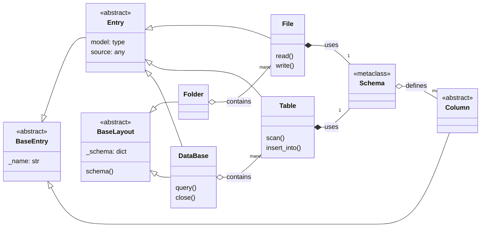

# Framelib: Code Architecture

This document provides a deep dive into the internal architecture of `framelib`. It is intended for developers who want to contribute to the library or understand its design principles. This document explains *how* the code is structured, not *what* it does from a user's perspective.

## Table of Contents

- [Core Concepts](#core-concepts)
- [High-Level Architecture](#high-level-architecture)
  - [Component Diagram](#component-diagram)
- [Design Philosophy](#design-philosophy)
  - [Declarative Layouts](#declarative-layouts)
  - [The Role of `pyochain`](#the-role-of-pyochain)
- [Component Deep Dive](#component-deep-dive)
  - [`BaseLayout`: The Foundation](#baselayout-the-foundation)
  - [`Folder` and `File`](#folder-and-file)
  - [`DataBase` and `Table`](#database-and-table)
  - [`Schema` and `Column`](#schema-and-column)

## Core Concepts

The entire library is built upon a few fundamental abstract classes defined in `_core.py`:

1. **`BaseEntry`**: The most basic building block. It's an abstract class that simply requires a `_name` attribute. Any component that can be part of a layout (like a `File` or a `Table`) inherits from it.

2. **`Entry[T, U]`**: A more specialized `BaseEntry`. It represents a component that has a `source` (e.g., a file path, a database connection string) and a `model` (a data schema, typically a `framelib.Schema` subclass). `File` and `Table` are implementations of `Entry`.

3. **`BaseLayout[T]`**: An abstract container for `Entry` objects. It represents a static collection of entries, like a directory of files or a database of tables. Its main responsibility is to collect all its `Entry` members into a `_schema` dictionary upon class definition. `Folder` and `DataBase` are implementations of `BaseLayout`.

## High-Level Architecture

`framelib` is designed around the concept of **declarative data layouts**. You define the structure of your project (folders, files, databases, tables) as Python classes, and `framelib` uses this declaration to provide a functional API for interacting with your data.

The main components are:

- **`Folder`**: Represents a directory on the filesystem. It is a layout containing `File` entries.
- **`File`**: Represents a single file (e.g., `Parquet`, `CSV`). It is an entry within a `Folder`.
- **`DataBase`**: Represents a DuckDB database file. It is a layout containing `Table` entries. It also behaves like a `File` so it can be placed within a `Folder`.
- **`Table`**: Represents a table within a `DataBase`. It is an entry within a `DataBase`.
- **`Schema`**: A collection of `Column` definitions that describes the structure of the data within a `File` or `Table`.
- **`Column`**: The smallest unit, representing a column's name, data type, and constraints.

### Component Diagram

This Mermaid diagram illustrates the inheritance and composition relationships between the core components.



## Design Philosophy

### Declarative Layouts

The core design pattern is to let the user declare the layout of their data assets using simple Python class syntax.

**Example:**

```python
class MyData(fl.Folder):
    raw_data = fl.Parquet(model=RawSchema)
    processed = fl.CSV()

class MyDatabase(fl.DataBase):
    users = fl.Table(model=UsersSchema)
```

This declarative approach serves as a single source of truth for the project's structure. The library introspects these class definitions at creation time (not instantiation time) to build its internal representation.

### The Role of `pyochain`

`pyochain` is central to the introspection mechanism. It allows for a clean, functional, and chainable way to process class attributes without writing complex loops or metaclasses from scratch.

This is best illustrated by the `_add_entries` method in `BaseLayout`:

```python
# framelib/_core.py

class BaseLayout[T](ABC):
    # ...
    def __init_subclass__(cls) -> None:
        cls._schema: dict[str, T] = {}
        cls._add_entries()

    @classmethod
    def _add_entries(cls):
        return (
            pc.Dict.from_object(cls)
            .filter_attr(cls.__entry_type__, BaseEntry)
            .for_each(_add_to_schema, cls._schema)
        )
```

Here is the breakdown of the chain:

1. **`pc.Dict.from_object(cls)`**: Introspects the class `cls` and creates a `pyochain.Dict` of its attributes (`{attribute_name: attribute_value}`).
2. **`.filter_attr(cls.__entry_type__, BaseEntry)`**: This is the magic step. It filters the attributes to keep only those that are instances of `BaseEntry` (or its subclasses like `File`, `Table`) and have a specific flag (e.g., `_is_file=True` for `Folder` layouts). This is how a `Folder` knows to only collect `File`s and a `DataBase` knows to only collect `Table`s.
3. **`.for_each(_add_to_schema, cls._schema)`**: For each filtered attribute, it calls the `_add_to_schema` function, which populates the `cls._schema` dictionary. This function also injects the attribute name into the entry instance (e.g., the `File` instance gets `_name = 'raw_data'`).

This elegant use of `pyochain` in `__init_subclass__` allows `framelib` to configure itself the moment a class is defined, making the setup transparent and automatic.

## Component Deep Dive

### `BaseLayout`: The Foundation

`BaseLayout` is the parent of `Folder` and `DataBase`. Its primary role is to automatically discover and register its children entries (`File` or `Table`) during class definition using the `pyochain` mechanism described above.

### `Folder` and `File`

- A `Folder` is a `BaseLayout` for `File` entries.
- When a `Folder` class is defined, it automatically sets the `source` path for all its `File` children. It constructs the path from its own name and the name of the `File` entry.
- The `__set_source__` method on the `File` object is called by the `Folder` to inject this path. This is how a `File` instance knows where it lives on the filesystem without the user having to specify the full path repeatedly.

```python
# framelib/_folder.py
class Folder(BaseLayout[File[Schema]]):
    # ...
    def __init_subclass__(cls) -> None:
        super().__init_subclass__()
        # ...
        cls.__source__ = cls.__source__.joinpath(cls.__name__.lower())
        cls._set_files_source() # This calls __set_source__ on each file

# framelib/_filehandlers.py
class File[T: Schema](Entry[T, Path], ABC):
    # ...
    def __set_source__(self, source: Path | str) -> None:
        self.source = Path(source, self._name)
        # ...
```

### `DataBase` and `Table`

- The relationship between `DataBase` and `Table` is analogous to `Folder` and `File`.
- A `DataBase` is a `BaseLayout` for `Table` entries.
- When a method on the `DataBase` is called (e.g., `db.query(...)`), it first establishes a connection to the DuckDB database file.
- It then iterates through its registered `Table` entries and injects the active `duckdb.DuckDBPyConnection` into each one by calling the `__set_connexion__` method.
- This allows a `Table` object to execute queries (`table.scan()`, `table.insert_into(...)`) on the correct database without needing to manage the connection itself. The `DataBase` acts as a connection manager for its tables.

```python
# framelib/_database/_database.py
class DataBase(...):
    # ...
    def _connect(self) -> None:
        if not self._is_connected:
            self._connexion = duckdb.connect(self.source)
            self._set_tables_connexion() # Calls __set_connexion__ on each table
            self._is_connected = True

# framelib/_database/_table.py
class Table[T: Schema](Entry[T, Path]):
    # ...
    def __set_connexion__(self, con: duckdb.DuckDBPyConnection) -> Self:
        self._con: duckdb.DuckDBPyConnection = con
        self._qry = Queries(self._name)
        return self
```

### `Schema` and `Column`

- A `Schema` is a declarative collection of `Column`s, using a `SchemaMeta` metaclass for setup.
- Similar to `BaseLayout`, `SchemaMeta` introspects the class attributes to collect all `Column` instances into a `_schema` dictionary.
- The `Schema` class provides two key functionalities:
    1. **Data Casting (`.cast`)**: It provides a method to cast a Narwhals DataFrame to the data types defined in the schema.
    2. **SQL DDL Generation (`.sql_schema`)**: It can generate the `CREATE TABLE` SQL statement, including column types and constraints (like `PRIMARY KEY`), directly from the `Column` definitions. This is used by `Table` to create itself in DuckDB.
- `Column` is the base for specific data types (`Integer`, `String`, etc.) and holds metadata like `primary_key` and `unique` status.
