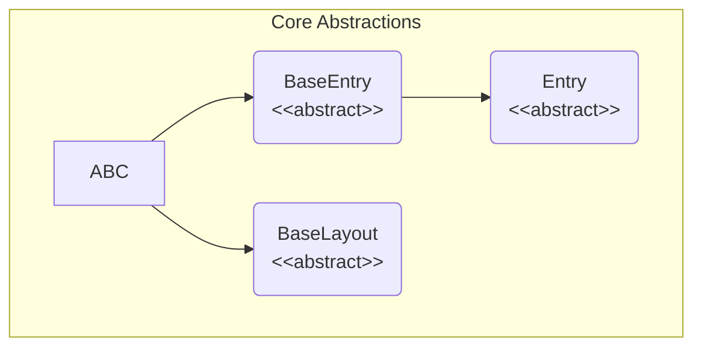
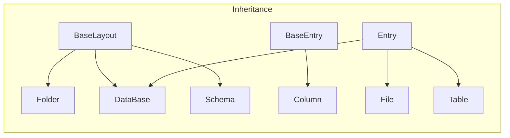
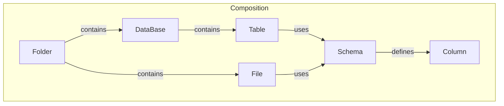

# Framelib: Code Architecture

This document provides a deep dive into the internal architecture of `framelib`. It is intended for developers who want to contribute to the library or understand its design principles. This document explains *how* the code is structured, not *what* it does from a user's perspective.

## Table of Contents

- [Core Concepts](#core-concepts)
- [The Startup Process: Class Definition as Configuration](#the-startup-process-class-definition-as-configuration)
- [High-Level Architecture](#high-level-architecture)
  - [Component Diagram](#component-diagram)
- [Architectural Subtleties and Interactions](#architectural-subtleties-and-interactions)
  - [`Schema`: An Agnostic Data Blueprint](#schema-an-agnostic-data-blueprint)
  - [`Folder`: A Versatile Container](#folder-a-versatile-container)
  - [`ParquetPartitioned`: A File that is a Folder](#parquetpartitioned-a-file-that-is-a-folder)
- [Component Deep Dive](#component-deep-dive)
  - [`BaseLayout` and the Role of `pyochain`](#baselayout-and-the-role-of-pyochain)
  - [`Folder` and `File` Interaction](#folder-and-file-interaction)
  - [`DataBase` and `Table` Interaction](#database-and-table-interaction)

## Core Concepts

The entire library is built upon a few fundamental abstract classes defined in `_core.py`:

- **`BaseEntry`**: The most basic building block. It's an abstract class that simply requires a `_name` attribute. Any component that can be part of a layout (like a `File` or a `Table`) inherits from it.

- **`Entry[T, U]`**: A more specialized `BaseEntry`. It represents a component that has a `source` (e.g., a file path) and a `model` (a data schema, typically a `framelib.Schema` subclass). `File` and `Table` are implementations of `Entry`.

- **`BaseLayout[T]`**: An abstract container for `Entry` objects. It represents a static collection of entries, like a directory of files or a database of tables. `Folder`, `DataBase`, and `Schema` are implementations of `BaseLayout`.

## The Startup Process: Class Definition as Configuration

A core principle of `framelib` is that **configuration happens at class definition time, not at instantiation time**. The library leverages the `__init_subclass__` hook to automatically set up the entire data layout the moment you define a class.

Here is the step-by-step process:

1. **A user defines a class** inheriting from `Folder`, `DataBase`, or `Schema`.

    ```python
    class MyData(fl.Folder):
        raw_data = fl.Parquet()
    ```

2. **`__init_subclass__` is triggered.** When the `MyData` class object is created by the Python interpreter, the `__init_subclass__` method on its parent class (`Folder`, which inherits it from `BaseLayout`) is called.

3. **Introspection via `pyochain`**. Inside `__init_subclass__`, the `_add_entries` method is called. This method uses `pyochain` to introspect the attributes of the newly defined class (`MyData`).

    ```python
    # framelib/_core.py
    @classmethod
    def _add_entries(cls):
        return (
            pc.Dict.from_object(cls)
            .filter_attr(cls.__entry_type__, BaseEntry) # Filters for Files, Tables, or Columns
            .for_each(_add_to_schema, cls._schema)
        )
    ```

    - It finds all attributes that are instances of a specific `BaseEntry` type (e.g., for a `Folder`, it looks for attributes with `_is_file=True`).
    - It populates the layout's `_schema` dictionary, mapping the attribute name (`"raw_data"`) to the entry instance (`Parquet()`).
    - Crucially, it injects the attribute name into the entry itself, so the `Parquet` instance now knows its name is `raw_data`.

4. **Source Path Injection**. For `Folder` and `DataBase` layouts, `__init_subclass__` performs an additional step: it calculates and injects the source path into each of its child entries.

    ```python
    # framelib/_folder.py
    class Folder(...):
        def __init_subclass__(cls) -> None:
            super().__init_subclass__()
            # ...
            cls.__source__ = cls.__source__.joinpath(cls.__name__.lower())
            cls._set_files_source() # This calls file.__set_source__(...) for each file
    ```

    The `MyData.raw_data` object now automatically knows its full path is `.../mydata/raw_data.parquet` without any explicit path manipulation from the user.

This "on-definition" configuration makes the API clean and declarative, turning classes themselves into the single source of truth for the data layout.

## High-Level Architecture

### Component Diagram

To make the architecture clearer, let's break down the relationships into three separate diagrams.

#### 1. Core Abstract Hierarchy

This diagram shows the fundamental abstract classes that form the building blocks of the library. `BaseLayout` is the foundation for any class that acts as a container, while `BaseEntry` is the base for any component that can be placed *inside* a layout.



#### 2. Concrete Class Inheritance

This diagram shows how the concrete classes you use (`Folder`, `File`, `Table`, etc.) inherit from the core abstract classes. Notice how `DataBase` inherits from both `BaseLayout` (to contain tables) and `Entry` (to be placeable inside a `Folder`).



#### 3. Composition and Relationships

This diagram illustrates how instances of these classes are composed. It shows what "contains" what and what "uses" what. This represents the structure of your data layout declaration.



## Architectural Subtleties and Interactions

### `Schema`: An Agnostic Data Blueprint

A `framelib.Schema` is fundamentally just a `BaseLayout` of `Column` entries. It is completely agnostic of its usage context.

- **Decoupling**: A `Schema` definition does not know whether it will be used to structure a `Parquet` file, a `CSV` file, or a `Table` in a database.
- **Reusability**: This makes schemas highly reusable. The same `UserSchema` can define the structure of a table and the structure of a parquet file used for backups.

```python
class UserSchema(fl.Schema):
    id = fl.Int64()
    name = fl.String()

# The same schema is used for a database table and a file
class MyDatabase(fl.DataBase):
    users = fl.Table(model=UserSchema)

class Backups(fl.Folder):
    users_backup = fl.Parquet(model=UserSchema)
```

### `Folder`: A Versatile Container

A `Folder` is designed to contain any entry that identifies as a "file".
Both `File` and `DataBase` have this attribute set to `True`. This is a deliberate design choice that allows a `DataBase` to be treated as a file within a `Folder` layout.

```python
class ProjectData(fl.Folder):
    # A Folder can contain regular files...
    raw_logs = fl.NDJson()

    # ...and it can also contain an entire database.
    analytics = fl.DataBase()
```

When this layout is defined, `framelib` will correctly resolve the paths:

- `ProjectData.raw_logs.source` will point to `.../projectdata/raw_logs.ndjson`.
- `ProjectData.analytics.source` will point to `.../projectdata/analytics.ddb`.

### `ParquetPartitioned`: A File that is a Folder

The `ParquetPartitioned` file handler is a special case. While declared as a file, it instructs the underlying engine (Polars) to write a directory structure based on the partition keys.

```python
class Output(fl.Folder):
    # This looks like a single file entry
    partitioned_data = fl.ParquetPartitioned(partition_by=["year", "month"])
```

If you write data for `year=2023` and `month=12`, the actual output on the filesystem will be a nested directory structure, not a single file:

```text
output/
└── partitioned_data/
    └── year=2023/
        └── month=12/
            └── *.parquet
```

`framelib` abstracts this away. You interact with `partitioned_data` as if it were a single entity, but on disk, it's a managed directory tree.

## Component Deep Dive

### `BaseLayout` and the Role of `pyochain`

As explained in the startup process, `BaseLayout` is the parent of `Folder`, `DataBase`, and `Schema`. Its primary role is to automatically discover and register its children entries during class definition. `pyochain` is the key tool that makes this introspection clean and functional, avoiding the need for complex metaclass logic.

### `Folder` and `File` Interaction

- A `Folder` is a `BaseLayout` for `File` entries.
- When a `Folder` class is defined, its `__init_subclass__` hook automatically sets the `source` path for all its `File` children. It constructs the path from its own name and the name of the `File` entry.
- The `__set_source__` method on the `File` object is called by the `Folder` to inject this path. This is how a `File` instance knows where it lives on the filesystem without the user having to specify the full path repeatedly.

### `DataBase` and `Table` Interaction

- The relationship between `DataBase` and `Table` is analogous to `Folder` and `File`.
- A `DataBase` is a `BaseLayout` for `Table` entries.
- When a method on the `DataBase` is called (e.g., `db.query(...)`), it first establishes a connection to the DuckDB database file.
- It then iterates through its registered `Table` entries and injects the active `duckdb.DuckDBPyConnection` into each one by calling the `__set_connexion__` method.
- This allows a `Table` object to execute queries (`table.scan()`, `table.insert_into(...)`) on the correct database without needing to manage the connection itself. The `DataBase` acts as a connection manager for its tables.
