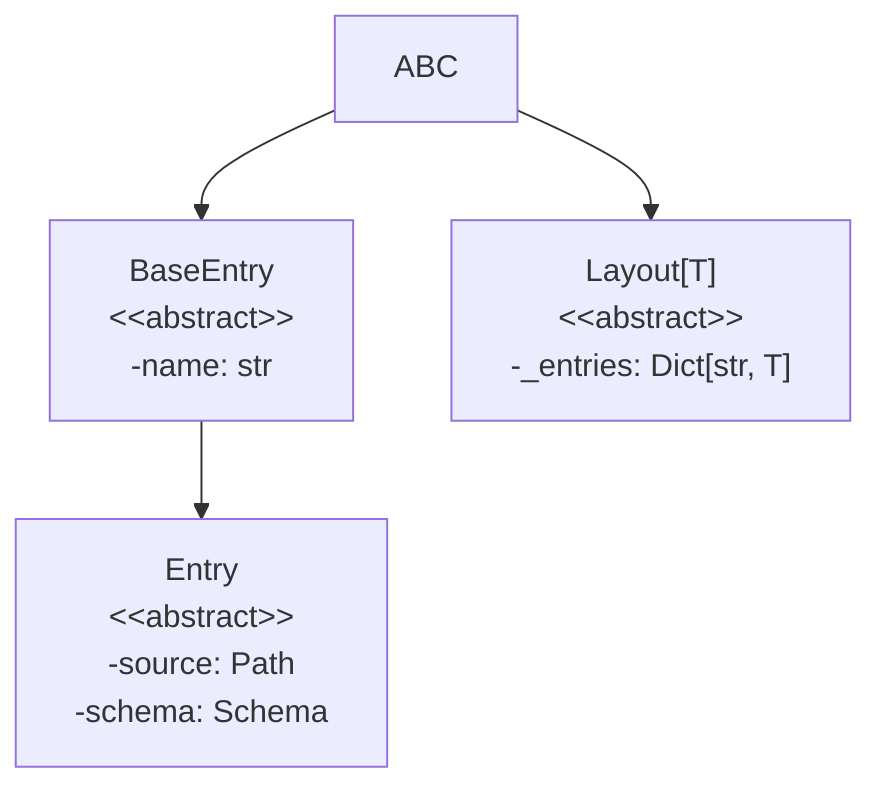
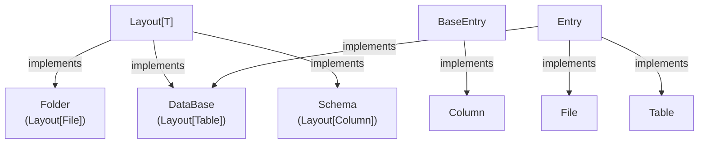
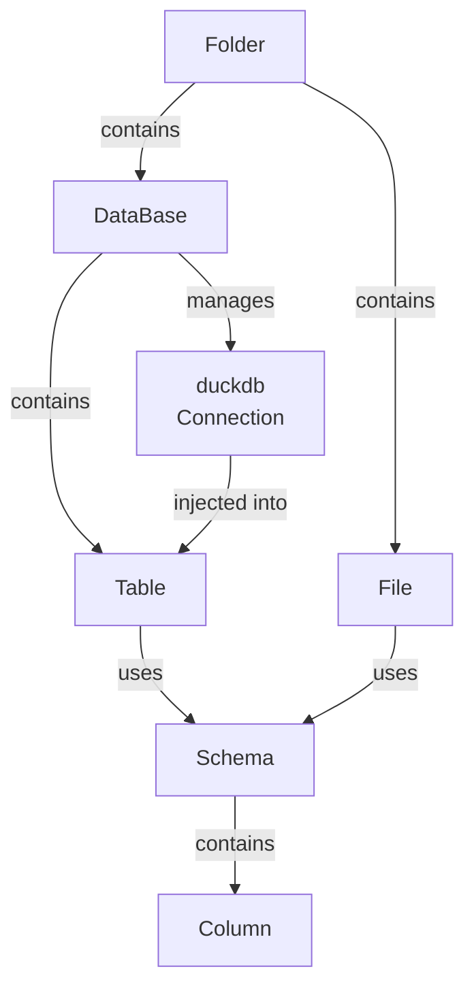

# Framelib: Code Architecture

This document provides a comprehensive guide to the internal architecture of `framelib`. It is intended for developers who want to contribute to the library or understand its design principles. This document explains *how* the code is structured and *why* design decisions were made, not *what* it does from a user's perspective.

## Core Design Philosophy

Framelib is built on a single, powerful principle: **Configuration happens at class definition time, not at instantiation time**.

Instead of manually managing paths, schemas, and connections at runtime, you declare your data architecture once as Python classes. The framework uses Python's class introspection (via `__init_subclass__`) to automatically set up the entire infrastructure—paths are calculated, schemas are registered, and connections are prepared—the moment your class is defined. This makes your codebase a single source of truth for your data layout.

## Core Concepts

The entire library is built upon a few fundamental abstract classes defined in `_core.py`:

- **`BaseEntry`**: The most basic building block. It represents any component that can be used as an attribute in a `Layout`. It has a `name` property representing its position in the layout.

- **`Entry[T]`**: A specialized `BaseEntry` with a `source` path and a `schema`. This represents data that lives somewhere (file, database table, etc.) and has a structure.

- **`Layout[T]`**: An abstract container for `Entry` objects of type `T`. It represents a static collection of entries, like a directory of files or a database of tables. `Folder`, `DataBase`, and `Schema` are concrete implementations of `Layout`.

The key insight is that `Layout` uses `__init_subclass__` to introspect class attributes at definition time, automatically registering all `BaseEntry` instances and computing derived values like paths and connections.

## The Startup Process: Class Definition as Configuration

A core principle of `framelib` is that **configuration happens at class definition time, not at instantiation time**. The library leverages the `__init_subclass__` hook to automatically set up the entire data layout the moment you define a class.

Here is the step-by-step process:

1. **A user defines a class** inheriting from `Folder`, `DataBase`, or `Schema`.

    ```python
    class MyData(fl.Folder):
        raw_data = fl.Parquet()
    ```

2. **`__init_subclass__` is triggered.** When the `MyData` class object is created by the Python interpreter (basically when you launch your program), the `__init_subclass__` method on its parent class (`Folder`, which inherits it from `Layout`) is called.

3. **Introspection via `pyochain`**. Inside `__init_subclass__`, the entries dictionary is populated using functional iteration. The `Layout` base class uses `pyochain` to introspect the attributes of the newly defined class (`MyData`).

```python
# framelib/_core.py (simplified)
def __init_subclass__(cls) -> None:
    def _is_base_entry(obj: object) -> TypeIs[T]:
        return isinstance(obj, BaseEntry)

    cls._entries = (
        pc.Iter(cls.__dict__.items())
        .filter_star(lambda _, obj: _is_base_entry(obj))
        .collect(pc.Dict)
        .inspect(
            lambda x: x.items()
            .iter()
            .for_each_star(lambda name, entry: entry.__set_entry_name__(name))
        )
    )
```

- It finds all attributes that are instances of a `BaseEntry` type (e.g., `File`, `Table`, `Column` instances).
- It populates the layout's `_entries` dictionary, mapping the attribute name (`"raw_data"`) to the entry instance (`Parquet()`).
- Crucially, it calls `__set_entry_name__` on each entry, injecting the attribute name so the `Parquet` instance now knows its name is `"raw_data"`.

1. **MRO-based entries inheritance (for `Schema` only)**. For `Schema` classes, an additional introspection step processes the Method Resolution Order (MRO) to collect columns from all parent schema classes. This allows entries inheritance:

    ```python
    class BaseSchema(fl.Schema):
        created_at = fl.Timestamp()

    class UserSchema(BaseSchema):
        id = fl.Int64(primary_key=True)
        name = fl.String()
    
    # UserSchema now contains both 'created_at' and its own columns
    ```

2. **Path Injection (for `Folder` only)**. For `Folder` classes, an additional step computes and injects source paths into each `File` child:

    ```python
    # framelib/_folder.py
    class Folder(Layout[File]):
        def __init_subclass__(cls) -> None:
            super().__init_subclass__()
            cls._set_files_source()
    
        @classmethod
        def _set_files_source(cls) -> None:
            if not hasattr(cls, '__source__'):
                cls.__source__ = Path()
            
            cls.__source__ = cls.__source__.joinpath(cls.__name__.lower())
            return (
                cls.entries()
                .values()
                .iter()
                .for_each(lambda file: file.__set_source__(cls.source()))
            )
    ```

    The `MyData.raw_data` object now automatically knows its full path is `.../mydata/raw_data.parquet` without any explicit path manipulation from the user.

3. **Connection Injection (for `DataBase` only)**. When a `DataBase` instance is used within a context manager or as a decorator, it:

- Establishes a connection to the DuckDB database file
- Injects this connection into each of its `Table` children via `__set_connexion__`
- This allows tables to execute queries without managing connections themselves

This "on-definition" configuration makes the API clean and declarative, turning classes themselves into the single source of truth for the data layout.

## High-Level Architecture

### Component Diagram

#### 1. Core Abstract Hierarchy

This diagram shows the fundamental abstract classes that form the building blocks of the library. `Layout` is the foundation for any class that acts as a container, while `BaseEntry` is the base for any component that can be placed *inside* a layout.



#### 2. Concrete Class Inheritance

This diagram shows how the concrete classes you use (`Folder`, `File`, `Table`, etc.) inherit from the core abstract classes. Notice how `DataBase` inherits from both `Layout` (to contain `Table` entries) and `Entry` (to be placeable inside a `Folder`).



#### 3. Runtime Composition and Relationships

This diagram illustrates how instances of these classes are composed at runtime. It shows what "contains" what and what "uses" what.



### Class Hierarchy

## Architectural Subtleties and Interactions

### `Layout`: The Foundation of Declarative Design

`Layout[T]` is the abstract base class for all container-like structures in framelib. Its core responsibility is to automatically discover and register `BaseEntry` instances when a class is defined.

**Key characteristics:**

- Uses `__init_subclass__` for automatic introspection
- Stores all entries in a `_entries` dictionary
- Provides a `entries()` class method to access entries
- Uses `pyochain` for functional iteration over entries

All `Layout` subclasses (`Folder`, `DataBase`, `Schema`) inherit this behavior and extend it with their own specializations.

### `Schema`: An Agnostic Data Blueprint

A `framelib.Schema` is fundamentally just a `Layout[Column]`—a container of `Column` entries that define the structure of data.

**Key design principle:** A `Schema` is completely agnostic of its usage context.

- **Decoupling**: A `Schema` definition does not know whether it will be used to structure a Parquet file, a CSV file, or a table in a database.
- **Reusability**: This makes schemas highly reusable. The same `UserSchema` can define the structure of a database table and a parquet file used for backups.

```python
class UserSchema(fl.Schema):
    id = fl.Int64(primary_key=True)
    name = fl.String()

# The same schema is used for a database table and a file
class MyDatabase(fl.DataBase):
    users = fl.Table(schema=UserSchema)

class Backups(fl.Folder):
    users_backup = fl.Parquet(schema=UserSchema)
```

Schemas also provide utility methods like `to_sql()`, `to_pl()`, and `cast()` for manipulating `Column` attributes in different contexts.

### `Column`: The Building Block of Schemas

A `Column` is a `BaseEntry` that represents a single field in a schema. Unlike `Entry`, columns don't have a `source` or `schema`—they are the leaves of the architecture tree.

**Key characteristics:**

- Holds metadata about the column (name, type, constraints)
- Provides multiple type representations: `pl_dtype`, `nw_dtype`, `sql_type`
- Supports constraints like `primary_key` and `unique`
- Generates SQL schemas via `to_sql()`, or Polars schemas via `to_pl()`

```python
class UserSchema(fl.Schema):
    id = fl.Int64(primary_key=True)
    name = fl.String()
    age = fl.UInt8()
    country = fl.Categorical()
```

Each column knows its datatype in three different contexts: Polars, Narwhals, and SQL. This triple representation allows seamless conversion between different data processing libraries.

## File and Database Operations

### File Operations with `scan()` and `read()`

Files provide two main access patterns:

- **`scan()`**: Returns a `pl.LazyFrame`, enabling lazy, composable operations. Used when you want to chain transformations before materialization.
- **`read()`**: Returns a `pl.DataFrame`, materializing the entire dataset into memory. Used when you need immediate access to the data.

Both methods return `partial` functions with the file path pre-bound:

```python
class MyProject(fl.Folder):
    data = fl.CSV(schema=UserSchema)

# These are equivalent to calling pl.read_csv(MyProject.data.source, ...)
result = MyProject.data.read()
lazy_result = MyProject.data.scan()
```

### Database Operations with `scan()` and `read()`

Tables provide similar patterns but with a key difference: operations happen on the database, not the local filesystem.

- **`scan()`**: Returns a `DuckFrame` (a `narwhals.LazyFrame` wrapping a DuckDB relation), enabling lazy queries.
- **`read()`**: Materializes the table as a `pl.DataFrame` for convenience. This is equivalent to `.scan().to_native().pl()`.

```python
class MyDatabase(fl.DataBase):
    users = fl.Table(schema=UserSchema)

class MyProject(fl.Folder):
    db = MyDatabase()

@MyProject.db
def process_users() -> None:
    # Lazy operations on the database
    filtered = MyProject.db.users.scan().filter(fl.col("age") > 18)
    
    # Materialize to Polars DataFrame
    result = MyProject.db.users.read()
    
    # Raw SQL access
    sql_result = MyProject.db.sql("SELECT * FROM users WHERE age > 18")
```

### `File`: Data Access Abstraction

`File` is an abstract `Entry` that represents a file on the filesystem. It encapsulates reading, scanning, and writing operations for different file formats.

**Key design:**

- Each `File` subclass (e.g., `Parquet`, `CSV`, `NDJson`, `Json`) provides `scan()`, `read()`, and `write()` properties
- These properties return `partial` functions with the file path already bound, so users can call `MyFolder.my_csv.read()` directly
- All files are associated with an optional `Schema` schema for type safety and validation
- The `__set_source__` method automatically computes the file path based on the parent `Folder` and the attribute name, suffixing with the file format's extension

**File formats supported:**

- `Parquet`: High-performance columnar format with optional partitioning (`ParquetPartitioned`)
- `CSV`: Standard comma-separated values
- `NDJson`: Newline-delimited JSON for streaming
- `Json`: Standard JSON format (scanned via DuckDB for lazy evaluation)

### `Folder`: A Versatile Container for Files

A `Folder` is a `Layout[File]` that represents a directory containing file entries. When a `Folder` is defined, it automatically computes paths for each of its `File` children.

**Key mechanism:**

1. The `Folder`'s own path is set to its lowercased class name
2. Each `File` child's path is set by appending its name to the `Folder`'s path
3. This happens via `_set_files_source()`, which is called during `__init_subclass__`

```python
class ProjectData(fl.Folder):
    raw_logs = fl.NDJson()      # → projectdata/raw_logs.ndjson
    users_backup = fl.Parquet() # → projectdata/users_backup.parquet
```

**Important:** A `Folder` can contain not just `File` entries, but also `DataBase` entries. This is possible because `DataBase` inherits from `BaseEntry`, making it compatible with `Folder`'s introspection mechanism. This allows for hierarchical data structures where databases are nested within folder hierarchies.

### `DataBase`: A Dual-Role Entry and Container

`DataBase` is unique in the architecture because it plays two roles simultaneously:

1. **As a `Layout[Table]`**: It contains and manages `Table` entries
2. **As an `Entry`**: It can be placed inside a `Folder`

```python
class MyProject(fl.Folder):
    db = fl.DataBase()  # ← DataBase acts as an Entry here
    
class MyDatabase(fl.DataBase):
    users = fl.Table(schema=UserSchema)  # ← DataBase acts as a Layout here
```

**Multiple inheritance pattern:**

```python
class DataBase(Layout[Table], BaseEntry, ABC, contextlib.ContextDecorator):
    ...
```

This dual inheritance allows `DataBase` to:

- Be discovered and registered by its parent `Folder`
- Manage its own collection of `Table` children
- Participate in path and connection management hierarchies

### Connection Management Strategy

Unlike `Folder`, which manages paths statically at class definition time, `DataBase` manages connections dynamically at runtime using the context manager protocol.

**The three-phase lifecycle:**

1. **Definition phase** (`__init_subclass__`): The `DataBase` class is defined, but no connection exists
2. **Activation phase** (`__enter__`): When entering the context, a connection is established and injected into all `Table` children
3. **Cleanup phase** (`__exit__`): When exiting the context, the connection is closed

```python
class MyProject(fl.Folder):
    db = MyDatabase()  # Instance created once at class definition

# The connection is opened and closed automatically
with MyProject.db as db:
    db.users.insert_into(data)
    result = db.users.read()
# Connection is now closed
```

This lazy connection management ensures resources are only used when needed and prevents connection leaks.

## Component Deep Dive

### The Role of `pyochain` in Introspection

`pyochain` is the functional programming library that powers framelib's introspection and transformation capabilities. It provides:

- **`pc.Vec`**: A mutable sequence with functional transformations (map, filter, flat_map, etc.)
- **`pc.Dict`**: A superset of `dict` with conversion methods to/from other collections
- **`pc.Option` and `pc.Result`**: Type-safe handling of optional values/fallible computations

In the context of `Layout.__init_subclass__`, `pyochain` is used to perform **MRO-based introspection** to collect `BaseEntry` instances from the entire class hierarchy:

```python
cls._entries = (
    pc.Vec.from_ref(cls.mro())  # Convert MRO list to a pyochain Vec for zero-copy conversion
    .rev()  # Get a reversed Iterator to process from base to derived
    .filter(lambda c: c is not object and hasattr(c, "__dict__"))  # Keep only classes with attributes
    .flat_map(lambda c: c.__dict__.items())  # Flatten all attributes from all classes
    .filter_star(lambda _, obj: _is_base_entry(obj))  # Keep only BaseEntry instances
    .collect(pc.Dict)  # Convert to a pyochain Dict
    .inspect(  # Side effect: register names in entries
        lambda x: x.items()
        .iter()
        .for_each_star(lambda name, entry: entry.__set_entry_name__(name))
    )
)
```

**Why MRO-based introspection?** This approach enables entries inheritance. When a class inherits from another class that is also a `Layout`, the child class automatically inherits all entries from its parent.

By processing the entire MRO (reversed from base to derived), entries from parent classes are included in the schema, allowing you to extend schemas hierarchically.

This functional approach makes the code more declarative and composable, while also enabling powerful inheritance patterns across the class hierarchy.

### `Folder` and `File` Interaction

The relationship is straightforward but elegant:

- A `Folder` is a `Layout[File]`
- When a `Folder` class is defined, its `__init_subclass__` calls `_set_files_source()`
- This iterates through all `Entry` childrens and calls `__set_source__` with the computed path
- Each `Entry` now knows exactly where it will live on the filesystem

```python
class Data(fl.Folder):
    raw = fl.CSV()
    db = fl.MyDatabase()

# At this point, Data.raw.__source__ is already set to Path("data/raw.csv")
# Data.db.__source__ is set to Path("data/mydatabase.ddb")
```

This mechanism ensures that:

1. Paths are computed deterministically from the class structure
2. Paths can be accessed statically without instantiation
3. No manual path management is required

### `DataBase` and `Table` Interaction

The relationship is more dynamic than `Folder` and `File`:

- A `DataBase` is a `Layout[Table]`
- A `DataBase` is also an `Entry`, making it composable within `Folder`
- The connection between `DataBase` and its `Table` children is established at runtime, not at definition time
- When `__enter__` is called on the `DataBase`, it:
  1. Establishes a `duckdb.DuckDBPyConnection`
  2. Iterates through all `Table` children
  3. Calls `__set_connexion__` on each table, injecting the connection

```python
class MyProject(fl.Folder):
    db = MyDatabase() # Created once, but no connection yet
with MyProject.db as db:
    db.users.read()  # Now the table can execute queries
# Connection automatically closed
```

This lazy connection pattern is critical because:

1. Database connections are expensive resources
2. They should only exist when actively needed
3. Automatic cleanup prevents connection leaks even if exceptions occur

## Project Visualization with `TreeBuilder`

Framelib provides a built-in facility to visualize your entire project structure as a tree. This is implemented via the `TreeBuilder` class in conjunction with the `show_tree()` method available on `Folder` classes.

**How it works:**

The `TreeBuilder` uses the Method Resolution Order (MRO) to traverse the class hierarchy and collect all `Folder` instances. It then recursively builds a visual representation of all nested files and databases:

```python
class MyProject(fl.Folder):
    raw_data = fl.CSV()
    processed = fl.Parquet()
    db = MyDatabase()

print(MyProject.show_tree())
# Output:
# myproject
# ├── raw_data.csv
# ├── processed.parquet
# └── db.ddb
```

**Key features:**

- Walks the entire `Folder` hierarchy to discover files and nested databases
- Uses ASCII tree characters for visual clarity
- Automatically computes relative paths from the root folder
- Works with deeply nested folder structures

This visualization is particularly useful for documenting your project structure and for debugging path-related issues.

## Design Patterns

### Context Manager Pattern

The `DataBase` class implements Python's context manager protocol (`__enter__` and `__exit__`) to provide safe, automatic connection management.

**Benefits:**

- Resource cleanup is guaranteed, even if an exception occurs
- The code clearly expresses intent: "within this block, I need database access"
- Connection state is implicit and managed by the runtime

```python
class MyProject(fl.Folder):
    db = MyDatabase()  # Instance created once

with MyProject.db as db:
    result = db.users.read()
    db.logs.insert_into(new_logs)
# Connection is automatically closed here, even if an exception occurred
```

### Decorator Pattern

The `DataBase` class also inherits from `contextlib.ContextDecorator`, which allows it to be used as a function decorator:

```python
class MyProject(fl.Folder):
    db = MyDatabase()

@MyProject.db
def load_and_process(df: pl.DataFrame) -> None:
    MyProject.db.users.insert_into(df)
    # Process...

# Connection opens before load_and_process() is called
# Connection closes after load_and_process() completes
load_and_process(data)
```

This is syntactic sugar over the context manager pattern, providing two ways to express the same thing:

- **Context manager**: `with db as d: ...` (for scope-specific usage)
- **Decorator**: `@db def func(): ...` (for function-level management)

## Implementation Guidelines for Contributors

### Adding a New `Entry` Type

To create a new file handler or entry type:

1. **Inherit from `Entry`**: Ensure your class has `source` and `schema` attributes
2. **Implement `__set_source__`**: Store the injected path from parent `Layout`
3. **Provide read/write methods**: Implement the data access interface (e.g., `read()`, `scan()`, `write()`)

Example:

```python
class CustomFile(Entry):
    def __set_source__(self, source: Path) -> None:
        self.__source__ = source.with_suffix(".custom")
    
    def read(self):
        # Implement reading from source
        pass
    
    def write(self, data):
        # Implement writing to source
        pass
```

## Summary

Framelib's architecture achieves declarative, type-safe data management through:

1. **Automatic introspection at class definition time** via `__init_subclass__`
2. **Functional composition** using `pyochain` for clean, composable transformations
3. **Dual-role design** allowing `DataBase` to be both container and entry
4. **Lazy resource management** for connections using context managers
5. **Type-safe schemas** that are agnostic to their usage context
6. **Multiple inheritance and MRO-based pattern** for schema inheritance

The result is a system where your data architecture is both a configuration and documentation artifact, reducing boilerplate while maintaining type safety and clarity.
